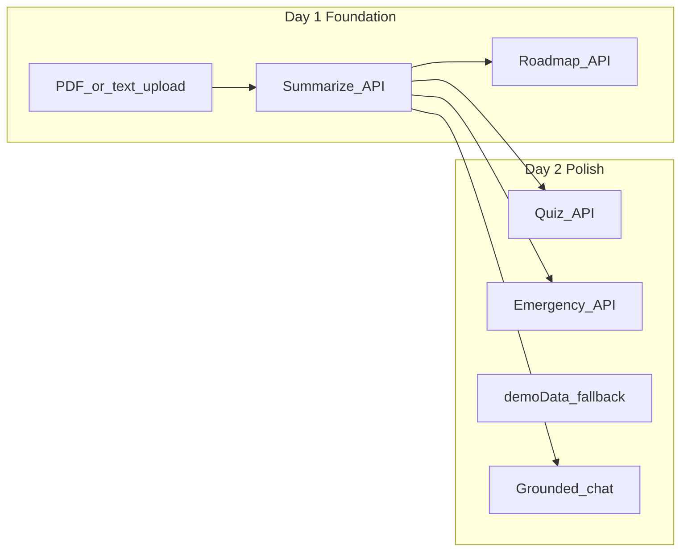

# AI Student Second Brain — Implementation Plan

Source of truth: [`AI Student SecondBrain HackathonPlan.docx`](c:\Users\hp\Cursor-hack\Aemro-Sprint\AI Student SecondBrain HackathonPlan.docx) (repo root).

Your setup already matches the doc’s recommended starter (Vercel AI Chatbot copied into this repo). **Do not re-fork or re-init git.** Build on what exists.

---

## Current repo baseline (what we keep)

| Area | Location | Role |
|------|----------|------|
| Chat UI | [`components/chat/shell.tsx`](components/chat/shell.tsx), [`hooks/use-active-chat.tsx`](hooks/use-active-chat.tsx) | Main UX; layout always mounts `ChatShell` ([`app/(chat)/layout.tsx`](app/(chat)/layout.tsx)) |
| Chat API | [`app/(chat)/api/chat/route.ts`](app/(chat)/api/chat/route.ts) | Streaming AI + tools |
| Auth / DB | [`app/(auth)/auth.ts`](app/(auth)/auth.ts), [`lib/db/schema.ts`](lib/db/schema.ts) | Guest + registered users, chat history |
| Artifacts | `createDocument` / text editor | Reuse for long-form outputs if needed |
| File upload | [`app/(chat)/api/files/upload/route.ts`](app/(chat)/api/files/upload/route.ts) | **Images only today** — not suitable for PDFs |



---

## Architecture decision: adapt the doc to this repo

The hackathon doc assumes a **standalone dashboard** at `app/page.tsx`. Your app uses **`(chat)` route group** with `ChatShell` as the primary surface ([`app/(chat)/page.tsx`](app/(chat)/page.tsx) is `null`).

**Approach (minimal disruption):**

1. Add a **Study Workspace** panel in the empty-chat area of `ChatShell` (replaces/enhances [`components/chat/greeting.tsx`](components/chat/greeting.tsx) when `messages.length === 0`).
2. Add **dedicated study API routes** under `app/(chat)/api/study/*` (not inside the streaming chat route) for structured JSON — matches the doc’s Prompts 1–5 and keeps debugging simple.
3. Keep the **existing chat** for P2 “Ask Anything”; inject uploaded material + summary into the **system prompt** via optional `studyContext` on the chat request body.
4. Add **`lib/demo-data.ts`** + “Try Demo” for judge-safe demos (doc §10, §12).

No Pinecone, LangChain, Docker, or Python backend.

---

## MVP scope (doc §4 — build only these first)

| Priority | Feature | Implementation |
|----------|---------|----------------|
| P0 | PDF / text upload + parsing | New `POST /api/study/upload` with `pdf-parse`; text paste in UI |
| P0 | Study summary | `POST /api/study/summarize` → structured `SummaryJSON` |
| P0 | Study roadmap | `POST /api/study/roadmap` → day-by-day plan array |
| P1 | Quiz / flashcards | `POST /api/study/quiz` + `QuizCard` / `QuizSession` components |
| P1 | Emergency Exam Mode | `POST /api/study/emergency` + red “Panic Mode” UI |
| P2 | Chat on your material | Extend chat schema + [`lib/ai/prompts.ts`](lib/ai/prompts.ts) with `secondBrainPrompt` + client context |

**Stretch (only after MVP is polished):** weak-topic analysis, adaptive roadmap, export PDF, progress tracker (doc §5).

---

## New files to add

### Types & demo

- [`lib/study/types.ts`](lib/study/types.ts) — `SummaryJSON`, `RoadmapDay`, `QuizQuestion`, `EmergencyPlan` (Zod schemas shared by API + UI)
- [`lib/demo-data.ts`](lib/demo-data.ts) — `DEMO_SUMMARY`, `DEMO_ROADMAP`, `DEMO_QUIZ`, `DEMO_EMERGENCY` (doc Prompt 10)

### API routes (App Router, auth-protected like existing routes)

| Route | Input | Output |
|-------|-------|--------|
| [`app/(chat)/api/study/upload/route.ts`](app/(chat)/api/study/upload/route.ts) | `FormData` PDF or `.txt` | `{ text: string, fileName: string }` |
| [`app/(chat)/api/study/summarize/route.ts`](app/(chat)/api/study/summarize/route.ts) | `{ text }` | `SummaryJSON` |
| [`app/(chat)/api/study/roadmap/route.ts`](app/(chat)/api/study/roadmap/route.ts) | `{ summary, examDate, hoursPerDay }` | `RoadmapDay[]` |
| [`app/(chat)/api/study/quiz/route.ts`](app/(chat)/api/study/quiz/route.ts) | `{ text, topic?, difficulty? }` | 10 MC questions |
| [`app/(chat)/api/study/emergency/route.ts`](app/(chat)/api/study/emergency/route.ts) | `{ summary, hoursRemaining }` | `EmergencyPlan` |

**AI calls:** Use existing [`lib/ai/providers.ts`](lib/ai/providers.ts) / gateway model (e.g. default from [`lib/ai/models.ts`](lib/ai/models.ts)) with `generateObject` + Zod schema for reliable JSON (doc wants structured outputs; better than raw string parsing).

**Truncation:** Cap extracted text sent to models (~12–15k chars) to avoid token limits; show toast if truncated.

### UI components (`components/study/`)

- `study-workspace.tsx` — hero, upload zone ([`react-dropzone`](https://www.npmjs.com/package/react-dropzone)), exam date + hours/day inputs, 3-column results grid, loading skeletons
- `summary-card.tsx` — topics, deadlines, objectives
- `roadmap-view.tsx` — vertical timeline (doc Prompt 8): priority border colors, TODAY badge
- `quiz-card.tsx` + `quiz-session.tsx` — flip-card MC flow, progress bar, score summary (doc Prompt 7)
- `emergency-panel.tsx` — panic output: priority topics, must-know, skip list, ordered minutes

### Client state

- [`hooks/use-study-context.tsx`](hooks/use-study-context.tsx) — `extractedText`, `summary`, `roadmap`, `quiz`, `examDate`, `hoursPerDay`, `isDemo`, `setFromDemo()`
- Wrap in [`app/(chat)/layout.tsx`](app/(chat)/layout.tsx) inside `ActiveChatProvider` so chat + study share context

---

## Files to modify (existing)

| File | Change |
|------|--------|
| [`package.json`](package.json) | Add `pdf-parse`, `react-dropzone`; types `@types/pdf-parse` if needed |
| [`components/chat/shell.tsx`](components/chat/shell.tsx) | Render `StudyWorkspace` when no messages; show chat below after first message or via compact “Ask about material” CTA |
| [`components/chat/greeting.tsx`](components/chat/greeting.tsx) | Rebrand copy: “Second Brain”, student tagline |
| [`lib/constants.ts`](lib/constants.ts) | Replace generic [`suggestions`](lib/constants.ts) with study prompts (e.g. “Explain week 3 topics”, “What should I study tonight?”) |
| [`lib/ai/prompts.ts`](lib/ai/prompts.ts) | Add `secondBrainPrompt`; append uploaded summary + excerpt to `systemPrompt` when `studyContext` present |
| [`app/(chat)/api/chat/schema.ts`](app/(chat)/api/chat/schema.ts) | Optional `studyContext: z.string().max(8000).optional()` |
| [`app/(chat)/api/chat/route.ts`](app/(chat)/api/chat/route.ts) | Pass `studyContext` into `systemPrompt` |
| [`hooks/use-active-chat.tsx`](hooks/use-active-chat.tsx) | Send `studyContext` in transport body from `useStudyContext()` |
| [`app/layout.tsx`](app/layout.tsx) | Title/description: “Second Brain” |
| [`components/chat/app-sidebar.tsx`](components/chat/app-sidebar.tsx) | Logo label “Second Brain” (tooltip/link text) |
| [`app/globals.css`](app/globals.css) | Light indigo/violet accent tokens if needed for demo polish (doc Prompt 6) |

**Leave unchanged unless broken:** `components/ui/*`, auth flow, Drizzle migrations, artifact tools, Playwright tests (update later if selectors change).

---

## User flow (matches doc §3)

1. **Upload** — Drop syllabus PDF or paste text → `upload` → `summarize` (auto-chain on success).
2. **Roadmap** — User sets exam date + hours/day → `roadmap` → `RoadmapView`.
3. **Quiz** — “Quiz Me” → `quiz` → `QuizSession` (flip 2–3 cards in demo).
4. **Panic** — “PANIC MODE” → `emergency` with `hoursRemaining` (default 24).
5. **Ask Anything** — User scrolls to / uses chat input; answers grounded via `studyContext` in system prompt.
6. **Try Demo** — Instant load from `demo-data.ts` (no API) for backup (doc §10).

---

## 48-hour execution order (doc §8, adapted)

### Day 1 — Foundation

| Block | Tasks |
|-------|--------|
| Morning | Confirm `pnpm dev` + env ([`.env.example`](.env.example)); install deps; implement `study/upload` + manual test with sample PDF |
| Afternoon | `summarize` + `roadmap` APIs; `StudyWorkspace` with upload + summary + roadmap cards wired end-to-end |
| Evening | Rebrand greeting/suggestions/metadata; `useStudyContext`; basic error toasts (sonner already in layout) |

### Day 2 — Demo-ready

| Block | Tasks |
|-------|--------|
| Morning | `quiz` API + `QuizCard` / `QuizSession`; `emergency` API + panic UI |
| Afternoon | Chat grounding (`studyContext`); `demo-data.ts` + “Try Demo”; disable buttons while loading |
| Evening | UI polish: skeletons, mobile grid, panic styling; rehearse 2-min script (doc §10); pre-cache demo PDF locally |

---

## API prompt shapes (from doc §9 — condensed)

- **Summarize:** topics[], deadlines[], learningObjectives[], courseName?, difficulty?
- **Roadmap:** `{ day, date, topics, tasks, estimatedHours, priority }` per day until exam
- **Quiz:** exactly 10 MCQs with `correctIndex` + `explanation`
- **Emergency:** direct, no-fluff coach; `priorityTopics`, `mustKnowFacts`, `skipThese`, `studyOrder[{topic, minutes, why}]`, `mindsetTip`

---

## Smart hackathon shortcuts (doc §12 — approved)

- **Demo button** serves pre-baked JSON — primary judge path if API slow
- **Single file** upload for live demo; text paste as backup
- **No new DB tables** for MVP — context in React + optional `sessionStorage` refresh
- **Weak topics after quiz:** stretch — if time, derive from score % + `summary.weakTopics` hardcoded list
- **Do not** demo broken features; cut stretch before cutting P0

---

## What we explicitly avoid

- Replacing chat with a separate `app/page.tsx` dashboard (conflicts with current layout)
- Vector DB / RAG pipeline (doc §7: overkill for 48h); grounding = prompt injection of extracted text + summary
- LangChain, Docker, FastAPI sidecar
- Rewriting auth, Drizzle schema, or artifact system
- Force-pushing git or re-forking

---

## Risk notes

| Risk | Mitigation |
|------|------------|
| `pdf-parse` on Vercel serverless | Test early; fallback: text paste only + demo data |
| Large PDFs | 5MB limit (match existing upload pattern); truncate for AI |
| Chat schema change | Optional field — backward compatible |
| E2E tests reference old copy | Update selectors after rebrand or skip non-critical tests during crunch |

---

## Success criteria (ready to demo)

- [ ] Drop PDF → summary visible in &lt;60s (or instant via Try Demo)
- [ ] Generate roadmap from summary + exam date
- [ ] 10-question quiz with flip UI and score
- [ ] Panic mode returns prioritized cram list
- [ ] Chat answers reference uploaded course content
- [ ] 2-minute scripted demo works without apologies (doc §10–11)

---

## Team delegation — 3 members (equal split)

**Git workflow (each person):**

```bash
git checkout dev
git pull
git checkout -b feat/member-N-short-name
# ... work ...
git add . && git commit -m "feat(memberN): description"
git push origin feat/member-N-short-name
# Open PR into dev (not main)
```

**Merge order:** Member 1 → Member 2 → Member 3 (types/context must land before UI that imports them).

| Member | Focus | ~Files | Hours (est.) |
|--------|--------|--------|--------------|
| **Member 1** | Types, upload, summarize, roadmap APIs, study context, workspace shell + upload/summary/roadmap UI | 12 | 14–16 |
| **Member 2** | Quiz + emergency APIs, quiz/roadmap/emergency UI components | 8 | 14–16 |
| **Member 3** | Chat grounding, demo data, rebrand, shell integration, polish | 10 | 14–16 |

**Shared rules for everyone:**

- Repo root is the Next.js app (Vercel AI Chatbot copy). Do NOT re-fork, re-init git, or add LangChain/vector DB/Docker.
- New APIs go under `app/(chat)/api/study/` (not `app/api/`).
- Use `auth()` from `@/app/(auth)/auth` on every study API route.
- Use `generateObject` from `ai` + Zod schemas from `@/lib/study/types`.
- Use existing `getLanguageModel` from `@/lib/ai/providers` and `DEFAULT_CHAT_MODEL` from `@/lib/ai/models`.
- TypeScript strict, shadcn/ui + Tailwind, no `console.log`.
- Do not modify `components/ui/*` unless adding a missing shadcn component via CLI.

---

### Member 1 — Foundation & core pipeline

**Branch:** `feat/member1-study-foundation`

**Owns:** types, context, upload → summarize → roadmap APIs, study workspace shell (upload + summary + roadmap cards), `package.json` deps.

**Depends on:** nothing (go first).

**Blocks:** Member 2 and 3 need `lib/study/types.ts` and `hooks/use-study-context.tsx` merged before their PRs.

#### Cursor prompt (copy entire block into Agent mode)

```
CONTEXT
We are building "Second Brain" — an AI academic survival app on top of the Vercel AI Chatbot starter (Next.js App Router, already in this repo). Do NOT restructure the app, add vector DBs, LangChain, or Docker.

YOUR SCOPE (Member 1 only — do not build quiz, emergency, chat grounding, or full rebrand):
1. Shared types
2. Study context hook
3. Upload + summarize + roadmap API routes
4. Study workspace shell with upload zone, summary card, roadmap trigger
5. package.json dependencies

REFERENCE FILES TO READ FIRST:
- app/(chat)/api/chat/route.ts (auth + AI patterns)
- app/(chat)/api/files/upload/route.ts (FormData upload pattern)
- lib/ai/providers.ts, lib/ai/models.ts
- components/chat/shell.tsx
- app/(chat)/layout.tsx

TASK 1 — Create lib/study/types.ts
Export Zod schemas and TypeScript types for:
- SummaryJSON: { courseName?, topics: string[], deadlines: { label, date }[], learningObjectives: string[], difficulty? }
- RoadmapDay: { day: number, date: string, topics: string[], tasks: string[], estimatedHours: number, priority: 'critical'|'high'|'medium' }
- QuizQuestion, EmergencyPlan (define now so Member 2 can import — full shapes below)
  QuizQuestion: { id: string, question: string, options: [string,string,string,string], correctIndex: 0|1|2|3, explanation: string }
  EmergencyPlan: { priorityTopics: string[], mustKnowFacts: string[], skipThese: string[], studyOrder: { topic, minutes, why }[], mindsetTip: string }
Export truncateStudyText(text: string, maxChars?: number): string default 12000

TASK 2 — Create hooks/use-study-context.tsx
Client context with:
- extractedText, summary, roadmap, quiz, emergency (typed)
- examDate (string ISO date), hoursPerDay (number default 3)
- isDemo, isLoading, loadingStep ('idle'|'upload'|'summary'|'roadmap'|'quiz'|'emergency')
- setters + resetStudy()
- buildStudyContextString(): string for chat (summary JSON + first 4000 chars of extractedText)
Export StudyProvider + useStudyContext()

TASK 3 — package.json
Add: pdf-parse, react-dropzone. Run pnpm install.

TASK 4 — API routes (auth required, return JSON errors with proper status codes)

app/(chat)/api/study/upload/route.ts
- POST FormData: file (application/pdf or text/plain) OR field "text" for paste
- Max 5MB
- pdf-parse for PDF buffer
- Return { text, fileName, truncated: boolean }

app/(chat)/api/study/summarize/route.ts
- POST { text: string }
- truncateStudyText before AI
- generateObject with SummaryJSON schema
- System prompt: academic analyst extracting topics, deadlines, objectives from syllabus/notes

app/(chat)/api/study/roadmap/route.ts
- POST { summary: SummaryJSON, examDate: string, hoursPerDay: number }
- generateObject returning { days: RoadmapDay[] }
- System prompt: practical day-by-day study plan until examDate, time-blocked tasks

TASK 5 — UI components (components/study/)

study-workspace.tsx
- Hero: "Second Brain" + tagline "Your AI academic survival system"
- react-dropzone upload card + textarea "Or paste syllabus text"
- Inputs: exam date (type=date), hours per day (number)
- Buttons: "Analyze Material" (chains upload/paste → summarize), "Generate Roadmap"
- Grid area for SummaryCard + RoadmapView placeholder slot (Member 2 fills RoadmapView — import from ./roadmap-view if exists, else render summary of days as simple list for now)
- Use shadcn Card, Button, Badge, Skeleton
- Use useStudyContext for all state
- toast via sonner on success/error
- indigo/violet accent classes

summary-card.tsx
- Props: summary: SummaryJSON | null, isLoading
- Show topics, deadlines, objectives with Skeleton when loading

TASK 6 — Wire provider in app/(chat)/layout.tsx
Wrap ActiveChatProvider children with StudyProvider (StudyProvider outside or inside ActiveChatProvider — study context must be available to ChatShell)

TASK 7 — Partial shell integration
In components/chat/shell.tsx: when messages.length === 0, render <StudyWorkspace /> above MultimodalInput (keep existing chat input for "Ask Anything"). Do NOT remove chat functionality.

CONSTRAINTS
- Do NOT create quiz/emergency routes or QuizCard components (Member 2)
- Do NOT modify lib/ai/prompts.ts or chat route (Member 3)
- Do NOT create lib/demo-data.ts (Member 3)
- Match existing code style (Biome/Ultracite)
- Export types from lib/study/types.ts so other members can import

WHEN DONE
- pnpm dev works
- Paste text → Analyze → summary appears
- Set exam date → Generate Roadmap → days appear
- List files changed in summary comment
```

---

### Member 2 — Quiz, emergency & study UI components

**Branch:** `feat/member2-quiz-emergency`

**Owns:** quiz + emergency APIs, RoadmapView, QuizCard, QuizSession, EmergencyPanel, integrate into StudyWorkspace.

**Depends on:** Member 1 merged (`lib/study/types.ts`, `hooks/use-study-context.tsx`, `study-workspace.tsx` exists).

**Start after:** Pull `dev` with Member 1's types. If blocked, stub imports from `lib/study/types` locally and rebase later.

#### Cursor prompt (copy entire block into Agent mode)

```
CONTEXT
Second Brain hackathon app on Vercel AI Chatbot starter. Member 1 built: lib/study/types.ts, hooks/use-study-context.tsx, study upload/summarize/roadmap APIs, components/study/study-workspace.tsx (partial).

YOUR SCOPE (Member 2 only):
1. Quiz + Emergency API routes
2. RoadmapView, QuizCard, QuizSession, EmergencyPanel components
3. Wire quiz + panic UI into study-workspace.tsx

Do NOT: modify chat route/prompts, create demo-data, rebrand app metadata, or rebuild upload/summarize APIs.

READ FIRST:
- lib/study/types.ts
- hooks/use-study-context.tsx
- components/study/study-workspace.tsx
- app/(chat)/api/study/summarize/route.ts (copy pattern)

TASK 1 — app/(chat)/api/study/quiz/route.ts
POST { text: string, topic?: string, difficulty?: string }
- truncateStudyText
- generateObject: { questions: QuizQuestion[] } exactly 10 MCQs
- System prompt: genuine comprehension questions from material, not trivia
- Auth required

TASK 2 — app/(chat)/api/study/emergency/route.ts
POST { summary: SummaryJSON, hoursRemaining: number }
- generateObject: EmergencyPlan
- System prompt: crisis academic coach, brutally prioritized, no fluff, student has hoursRemaining until exam
- Auth required

TASK 3 — components/study/roadmap-view.tsx
Props: { days: RoadmapDay[], isLoading?: boolean }
- Vertical timeline, each day = Card
- Left border color by priority: critical=red, high=orange, medium=green
- Badges for topics, checklist for tasks, hours badge top-right
- Highlight today with "TODAY" badge
- Scroll into view today's card on mount (useEffect + ref)
- shadcn Badge, Card, Skeleton

TASK 4 — components/study/quiz-card.tsx
Props: { question, options, correctIndex, explanation, onAnswer: (correct: boolean) => void }
- Show question + 4 buttons
- On click: green correct, red wrong, show explanation
- Tailwind flip/perspective animation (no framer required)
- "Next" handled by parent

TASK 5 — components/study/quiz-session.tsx
Props: { questions: QuizQuestion[], onComplete?: (score: number, total: number) => void }
- Progress bar (shadcn Progress if available, else div)
- Maps QuizCard per question
- Final score card: "You scored X/10" + encouragement
- Optional: if score < 60% show "Focus on: ..." using first 3 topics from summary if passed via props

TASK 6 — components/study/emergency-panel.tsx
Props: { plan: EmergencyPlan | null, isLoading?: boolean }
- Red/danger styling for panic mode results
- Sections: Priority Topics, Must Know, Skip These, Study Order (topic + minutes + why), Mindset Tip
- Skeleton when loading

TASK 7 — Extend hooks/use-study-context.tsx (coordinate with Member 1 file)
Add methods:
- generateQuiz() — POST /api/study/quiz with extractedText
- generateEmergency(hoursRemaining?: number) — POST /api/study/emergency with summary
Store quiz + emergency in context

TASK 8 — Update components/study/study-workspace.tsx
- Replace roadmap placeholder with <RoadmapView />
- Add "Quiz Me" button → generateQuiz → show QuizSession in modal or expandable card
- Add red "PANIC MODE" button in hero → prompt hours (default 24) → generateEmergency → EmergencyPanel
- Disable buttons while isLoading
- Mobile: stack cards vertically (grid-cols-1 md:grid-cols-3)

CONSTRAINTS
- Import types from @/lib/study/types only
- Do not touch lib/demo-data, chat API, app/layout metadata
- TypeScript strict, accessible buttons (type="button"), no console.log

WHEN DONE
- With summary loaded: Quiz Me shows 10 flashcards
- Panic Mode shows emergency plan
- Roadmap timeline renders with priority colors
```

---

### Member 3 — Chat grounding, demo mode & polish

**Branch:** `feat/member3-chat-demo-brand`

**Owns:** demo data, Try Demo button, chat `studyContext`, prompts, rebrand, final shell polish.

**Depends on:** Member 1's `useStudyContext` (can develop demo/rebrand in parallel; integration PR after Member 1).

#### Cursor prompt (copy entire block into Agent mode)

```
CONTEXT
Second Brain hackathon on Vercel AI Chatbot starter. Member 1: study APIs + context + workspace shell. Member 2: quiz/emergency APIs + UI components.

YOUR SCOPE (Member 3 only):
1. lib/demo-data.ts + Try Demo in study workspace
2. Grounded chat (studyContext in system prompt)
3. Rebrand (metadata, greeting, suggestions, sidebar)
4. Final integration polish in shell + layout

Do NOT: rebuild upload/summarize/roadmap/quiz/emergency APIs or QuizCard components.

READ FIRST:
- hooks/use-study-context.tsx
- hooks/use-active-chat.tsx
- app/(chat)/api/chat/route.ts, app/(chat)/api/chat/schema.ts
- lib/ai/prompts.ts
- components/study/study-workspace.tsx
- components/chat/shell.tsx, greeting.tsx, lib/constants.ts

TASK 1 — lib/demo-data.ts
Export realistic demo for "Computer Science 301":
- DEMO_SUMMARY (SummaryJSON)
- DEMO_ROADMAP (7 RoadmapDay[])
- DEMO_QUIZ (10 QuizQuestion[])
- DEMO_EMERGENCY (EmergencyPlan)
- DEMO_EXTRACTED_TEXT (short string for chat context)
Make data specific and impressive (real-looking course topics, dates, tasks).

TASK 2 — Try Demo in study-workspace.tsx
Add button "Try Demo" that:
- Calls setFromDemo() on context (add to use-study-context if missing):
  loads all DEMO_* instantly, sets isDemo=true, no API calls
- toast.success("Demo mode loaded")

TASK 3 — Chat grounding

app/(chat)/api/chat/schema.ts
- Add optional studyContext: z.string().max(8000).optional()

app/(chat)/api/chat/route.ts
- Read studyContext from body
- Pass to systemPrompt({ requestHints, supportsTools, studyContext })

lib/ai/prompts.ts
- Add secondBrainPrompt constant: student academic co-pilot, answers MUST use provided course material, cite topics/deadlines when relevant, if no material say so
- Update systemPrompt to append secondBrainPrompt + studyContext when present

hooks/use-active-chat.tsx
- Import useStudyContext
- Include studyContext: buildStudyContextString() in DefaultChatTransport body when non-empty

TASK 4 — Rebrand
app/layout.tsx: title "Second Brain", description academic survival AI
components/chat/greeting.tsx: "What should we tackle before your exam?" + subtitle about syllabus upload
lib/constants.ts: replace suggestions array with 4 study prompts e.g. "What are my most urgent deadlines?", "Quiz me on the hardest topics", "I'm cramming tonight — what first?", "Summarize week 3 in 5 bullets"
components/chat/app-sidebar.tsx: tooltip/brand text "Second Brain" instead of "Chatbot"

TASK 5 — Shell polish (components/chat/shell.tsx)
- When messages.length === 0: StudyWorkspace visible, subtle divider, helper text "Ask anything about your material below"
- When user sends first message with study context loaded: workspace can collapse or stay — prefer compact header chip "Studying: CS 301" if summary.courseName exists
- Ensure MultimodalInput still works

TASK 6 — app/globals.css (minimal)
Add CSS variables or utility-friendly accent if not present: --study-primary indigo-600 vibe (optional, keep subtle)

TASK 7 — sessionStorage persistence (hackathon nice-to-have)
In use-study-context: on set summary/roadmap, persist to sessionStorage key 'second-brain-study'; hydrate on mount

CONSTRAINTS
- Do not delete getWeather tool or break existing chat tools
- studyContext is optional — chat must work without it
- No new database migrations
- No console.log

WHEN DONE
- Try Demo loads full flow instantly
- Chat answer references demo course when asked "what are my deadlines?"
- App title/branding says Second Brain
```

---

### Integration checklist (lead / after all 3 PRs)

1. Merge Member 1 → `dev`, resolve conflicts.
2. Merge Member 2 → `dev` (rebase on dev).
3. Merge Member 3 → `dev`.
4. Smoke test full flow: upload → summary → roadmap → quiz → panic → chat question.
5. Click **Try Demo** — rehearse 2-minute judge script from hackathon doc §10.
6. `pnpm build` once before deploy.

### Conflict hotspots (tell team upfront)

| File | Members | Rule |
|------|---------|------|
| `hooks/use-study-context.tsx` | 1, 2, 3 | M1 creates; M2 adds quiz/emergency methods; M3 adds setFromDemo + sessionStorage |
| `components/study/study-workspace.tsx` | 1, 2, 3 | M1 creates shell; M2 adds quiz/panic; M3 adds Try Demo |
| `components/chat/shell.tsx` | 1, 3 | M1 adds StudyWorkspace; M3 polishes — coordinate |
| `app/(chat)/layout.tsx` | 1 | M1 adds StudyProvider only |
